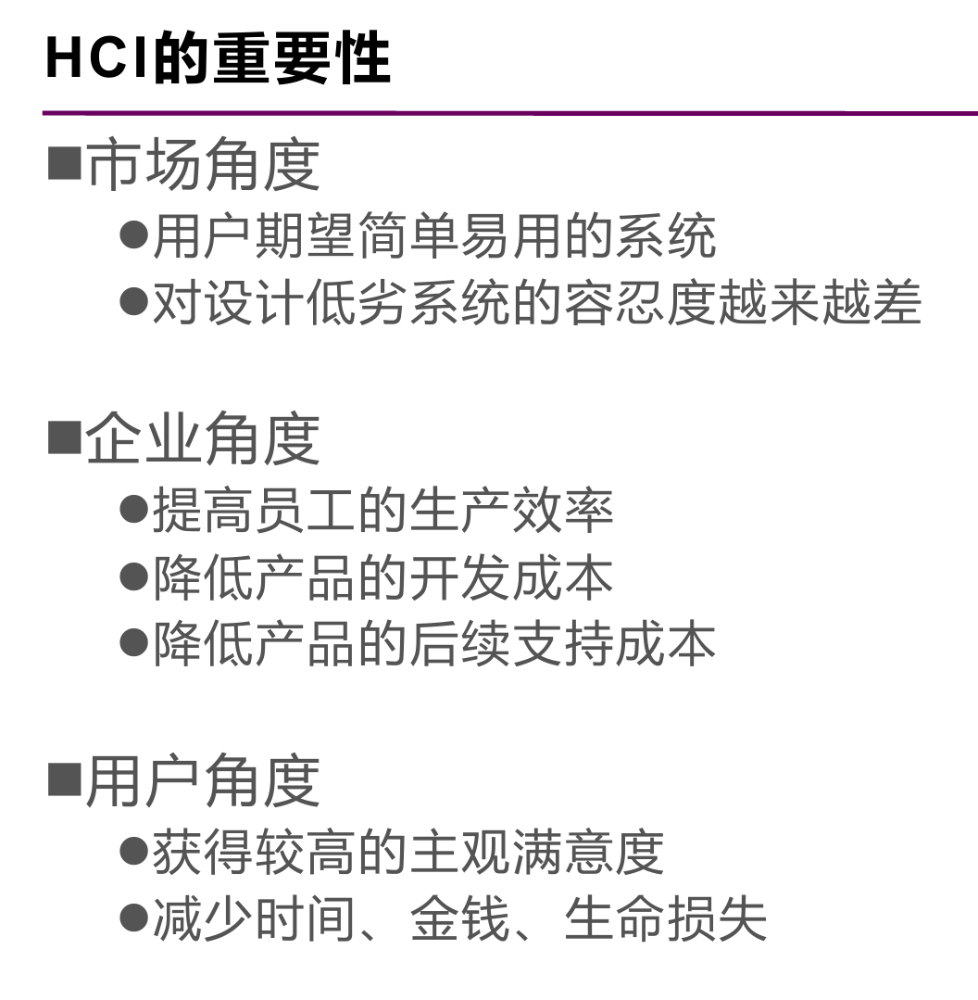
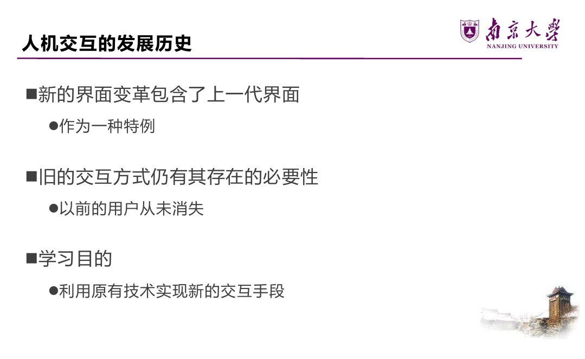
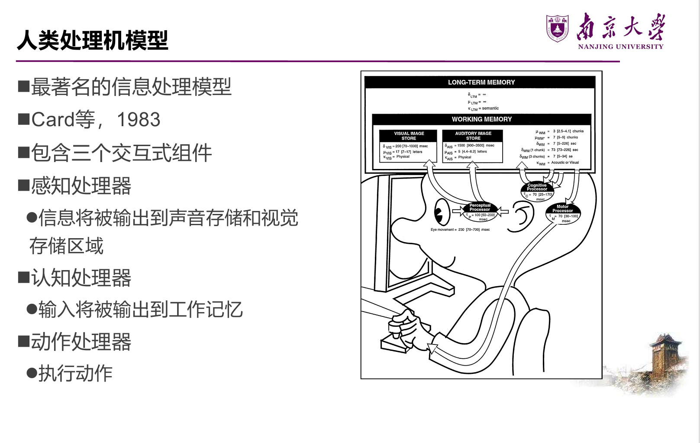

# Final
## lec1&2 人机交互概述
### 什么是人机交互

**人机交互**（Human-Computer Interaction，HCI）是研究人类与计算机系统之间的交互方式和设计原则的学科。它涉及到用户界面设计、用户体验、可用性评估等方面，旨在提高计算机系统的易用性和用户满意度。

### 人机交互的发展历史

### 人机交互与软件工程
前者是对后者的促进和补充，二者结合存在许多困难

## lec10 人机交互的基础知识

### 交互形式
- 直接操纵，如图形用户界面（GUI）；
- 隐喻，如桌面隐喻（Desktop Metaphor）；
- 问答，如命令行

### 信息处理模型
#### 人类处理机模型
**人类处理机模型**（Card 等，1983）：最著名的信息处理模型，含三个交互式组件——
  - **感知处理器**：信息输出到声音存储和视觉存储区域；
  - **认知处理器**：输入输出到工作记忆；
  - **动作处理器**：执行动作。

**存在的问题**：把认知描述为一系列处理步骤；仅关注**单个人、单个任务**，忽视复杂操作中人与人、任务与任务的互动以及环境影响 →（发展出）**外部认知模型、分布式认知模型**。

#### 格式塔心理学
研究人如何感知一个**良好组织的模式**，而非视为一系列相互独立的部分——**事物的整体区别于部分的组合**。"Gestalt"是德语"完形/型式"，故又称完形心理学。用户感知时总尽可能将其视为一个"好"的型式。核心原则：

- **相近性原则**：空间上靠近的物体容易被视为整体 → 设计界面时按相关性对组件分组（如列表页将相关信息组合重复排列，同组元素更靠拢使视觉聚焦）；
- **相似性原则**：习惯把看上去相似的物体看成整体 → 功能相近的组件用相同/相近的表现形式（用不同大小、颜色、形状创建对比或视觉权重，弱化或凸显内容）；
- **连续性原则**：共线或具有相同方向的物体会被组合 → 将组件对齐增强主观感知；
- **对称性原则**：相互对称且能组合为有意义单元的物体会被组合；
- **完整和闭合性原则**：人们倾向忽视轮廓间隙、将其视为完整整体 → 页面空白可帮助分组；
- **前景 & 背景**：某些情况下可互换（"整体区别于局部"）。

格式塔对界面理解影响深刻——屏幕格式塔（Law of lines）、文字格式塔、标题格式塔（如何理解粗体字）、段落格式塔等。

格式塔反例——**对比（Contrast）**让重点更突出。

#### 记忆特性
三个阶段（Atkinson 和 Shiffrin），彼此可交换信息：**感觉记忆 → 短时记忆 → 长时记忆**。

- **感觉记忆**（瞬时记忆）：在脑中持续约 **1 秒**，把相继出现的图片组合成连续序列，产生动态影像；
- **短时记忆**（工作记忆）：感觉记忆经编码形成，约保持 **30 秒**，储存当前正在使用的信息，是信息加工系统的核心（可理解为计算机内存），存储能力约 **7±2 个信息单元**；
  - **组块（chunking）**：通过将信息组合成有意义的单位帮助记住复杂信息（如 86-25-8362 1360-907）；
- **长时记忆**：短时记忆经进一步加工后变为长时记忆，**只有与长时记忆已有信息有某种联系的新信息才能进入**，容量几乎无限。
  - 启发：用**线索**引导用户完成任务；追求创新设计时也应结合优秀的交互范型。

**7±2 理论 vs. 交互式系统设计**：

- 表面影响：菜单最多 7 个选项、工具栏只显示 7 个图标；
- 事实：浏览菜单和工具栏基于人的**识别**功能，而**人识别事物的能力远胜于回忆**。设计时尽量减小记忆需求，可通过把信息放入一定上下文来减少信息单元数目。

**遗忘**：长时记忆中的信息有时无法提取，但不代表信息丢失。

**易出错**："人为错误"指人未发挥自身功能而产生的失误，可能降低交互系统功能——表面看是误解/误操作/大意，但**大部分交互问题源于系统设计本身**。

### 交互设备
- **基于命令的界面**：键入特定命令或组合键执行任务。优点：专家用户快速精确、较 GUI 节约系统资源、可动态配置选项；设计问题：命令的形式/语法/组织、标记命名命令的方法应尽量一致；
- **WIMP 和 GUI**：WIMP = Window, Icon, Menu, Pointing；GUI = Graphical User Interface。设计问题：窗口管理与切换、菜单选项的最佳术语、消除图标歧义；
- **多媒体界面**：在单个界面组合图形、文本、视频、声音、动画并连接各种交互。优点：呈现信息更好、增强快速访问能力、更易学更有乐趣；设计问题：何时用音频 vs 图形、声音 vs 动画；
- **虚拟现实和增强现实（VR & AR）**：身临其境，3D 空间中交互导航。设计问题：防止体验不好、最有效的导航方式（第一/第三人称）、虚拟环境中协作沟通；
- **信息可视化和仪表盘**：信息可视化是交互且动态的图形，目标提高发现/决策/解释能力；仪表盘往往不可交互、描述系统当前状态。设计问题：易理解易推理、是否用动画/交互、2D 还是 3D、何种隐喻；
- **笔式交互和触摸交互**；
- **手势界面**：借助相机、传感器和计算机视觉识别身体/手臂/手势，适用于双手不便时（家电控制、手术室）。设计问题：如何识别和描绘手势、确定手势的开始与结束；
- **实物界面（Tangible Interface）**：基于传感器，物理对象与数字表示结合，操纵物理对象引起数字效应。优点：创造性操纵、动态信息多方式呈现、支持多人探索；设计问题：物理活动与效果如何组合、用何种实物使操作自然；
- **可穿戴计算**：设计问题——舒适、卫生、续航、交互方式选择；
- **脑机界面**。

## lec3 交互设计目标与原则
### 交互框架：EEC 模型
**执行/评估活动周期**（Execution-Evaluation Cycle，EEC）是理解人机交互最有影响力的框架之一。
它把"用户与系统交互"这件事拆解成可分析的结构
四个核心要素：**目标（Goal）**、**执行（Execution）**、**客观因素 / 外部世界（World）**、**评估（Evaluation）**。
#### 目标（Goal）≠ 意图（Intention）

- **单个目标可以对应多个意图。**
  - 例：目标是"删除文档中的部分内容"。
    - 意图 1：通过编辑菜单删除；
    - 意图 2：通过删除按钮删除。
- **每个意图又可以包含一系列具体活动（动作）。**

#### EEC 的七个阶段

EEC 从**用户视角**探讨人机界面问题，一个完整循环代表一个动作，共七个阶段：

- **阶段 1–4：执行阶段**（确立目标 → 形成意图 → 明确动作序列 → 执行动作）；
- **阶段 5–7：评估阶段**（感知系统状态 → 解释系统状态 → 对照目标进行评估）。

> 经典例子：夜晚看书——产生"光线不够想看书"的目标，形成"开灯"的意图，执行按开关的动作，再观察、解释、评估房间是否变亮。
#### 执行隔阂 & 评估隔阂

EEC 模型可以解释**为什么有些界面用起来有问题**：

- **执行隔阂（Gulf of Execution）**：用户为达成目标所设想的动作，与系统实际允许的动作之间的差别。
- **评估隔阂（Gulf of Evaluation）**：系统状态的实际表现，与用户预期之间的差别。

好的设计就是要尽量**缩小这两个隔阂**。

### 可用性目标
可用性目标的目的，是为交互设计人员提供一套**评估交互式产品**各方面的具体方法。常见的可用性属性包括：易学性、易记性、效用性、高效率等。

#### 1. 易学性（Learnability）

- 指使用系统的难易程度，对应**学习曲线的开头部分**。
- 关键问题：用户**愿意花多少时间**学习一个产品？让用户学会执行某任务要花多长时间？
- 经验法则：**"10 分钟法则"**，理想情况下用户应能在很短时间内上手。

#### 2. 易记性（Memorability）

- 指学会使用后，**记住该产品如何使用**的难易程度，隔一段时间再用时能迅速回想，而不必重新学习。
- 影响因素（提升易记性的手段）：
  - **意义**：有意义的图标、命令名、菜单项；
  - **位置**：将特定对象放在固定的特殊位置；
  - **分组**：按逻辑对事物进行恰当分组；
  - **惯例**：尽可能使用通用的对象或符号；
  - **冗余**：用多个感知通道对同一信息进行编码。
- 启发：**良好的组织 + 借助用户已有经验**，能显著提高易记性。

#### 3. 效用性（Utility）

- 指产品在多大程度上提供了**正确的功能**，让用户能做他们需要做或想做的事。
- 高效用例：提供强大计算工具的会计软件包；
- 低效用例：只能画多边形、不允许徒手绘制的绘图工具。

#### 4. 高效率（Efficiency）

- 指用户**学会之后**，产品对其执行任务的支持程度，熟练用户应达到更高的生产力水平。
- 即用户到达学习曲线**平坦阶段**时的稳定绩效水平。需要考虑：**如何度量？**

#### 5. 安全性（Safety）

避免用户陷入危险或不好的情形，分两个层面：

- **工效学层面**：如在特殊/危险环境中允许远程操控计算机；
- **操作层面**：帮助用户在任何情况下避免因**偶然执行了不必要的操作**而造成的危险，也包括用户对"出错后果"的恐惧及其对行为的影响。
- 建议：
  - 减少按键/按钮**被误触发**的风险；
  - 为用户提供各种**出错后的恢复方法**。

### 用户体验目标
交互式系统通常包含**多样化的用户体验目标**，涵盖一系列情绪和感受（如有趣、愉悦、令人满足、有美感等）。

- 在**特定时间和地点**与产品交互时，选择最能传达用户感受、当前状态、情绪的词汇，可帮助设计者理解用户体验的**多面性与变化性本质**。

#### 体验与可用性的关系：主观 vs. 客观

可用性偏**客观**（能否高效完成任务），体验偏**主观**（用得开不开心），二者存在**矛盾性**：

- 许多玩家偏爱**最具挑战、不简单**的游戏，这恰恰"违反"了可用性；
- 用塑料锤砸"打地鼠"比鼠标点击更费劲、更易出错，但体验**更愉快有趣**；
- 有些可用性目标与体验目标**不兼容**（如一个既"绝对安全"又"刺激有趣"的过程控制系统可能不可取）。

> **认识并理解可用性与其他用户体验目标之间的关系，是交互设计的核心。**

#### 超越可用性 & 暗黑模式

- Schaffer 认为应**更多关注用户体验而非单纯可用性**：很多网站的目的是**说服或影响**用户，而非让用户最高效地完成任务（如网店核心策略是诱导购买"本不需要的东西"，这与可用性目标天然冲突）。
- **暗黑模式（Dark Pattern）**：某些"狡猾"的设计会刻意制造负面体验、误导用户。
- 正向的"以说服为目的的设计"，关键在于用**巧妙且令人愉快**的方式赢得用户信任、让用户舒服，而非欺骗

### 简易可用性工程
一种以**提高产品可用性**为目标的先进产品开发方法论, 强调**以人为中心**进行交互式产品的设计研发。

#### 四种关键技术（简化方法）

1. **用户和任务观察**
   - 了解目标用户是可用性工程的第一步；
   - 要**直接接触潜在用户**，不能满足于间接接触、道听途说；
   - 牢记：**"你"不是用户！**
2. **场景（Scenario）/ 原型**：通过省略系统部分内容来降低实现复杂度
   - **水平原型**：减少功能深度，呈现界面表层（覆盖面广但浅）；
   - **垂直原型**：减少功能数量，但对所选功能做完整实现（窄而深）。

3. **简化的边做边说（Thinking Aloud）**
   - 让真实用户在执行特定任务时**讲出自己的所思所想**；
   - 被认为是**最有价值的单个可用性工程方法**；
   - 能了解用户**为什么这样做**，并发现其对系统的误解；
   - 实验人员需不断提示用户，或请其事先观摩示范。

4. **启发式评估（Heuristic Evaluation）**
   - 研究表明能发现大量可用性问题，剩余的可用边做边说补充发现；
   - 为避免个人偏见，应让**多个不同的人**分别评估；
   - **需要多少名评估专家？** 用公式估算发现的问题数：
     - **发现的问题数 = N × (1 − (1 − L)ⁿ)**
     - N：设计中存在的可用性问题总数；
     - L：单个参与者能发现问题的比例（经验值约 **31%**）；
     - n：评估专家人数。
   - **结论：约 5 名专家可发现约 80% 的可用性问题**，被认为是最恰当的测试人数；建议**分阶段**进行测试。

### 交互设计原则
#### 基本规则（by Alan Dix）

- **可学习性（Learnability）**：新用户能据此开始有效交互并逐步获得最大性能；
- **灵活性（Flexibility）**：用户与系统能以多种方式交换信息；
- **健壮性（Robustness）**：在支持用户达成目标、评估成果方面提供的支持程度。

#### 黄金规则（Eight Golden Rules，by Ben Shneiderman）

1. **尽可能保证一致**——让界面熟悉、可预测，是**最容易被违背**的原则；体现在一致的动作序列、术语、颜色、布局、字体等。
2. **符合普遍可用性**——兼顾用户熟练度、年龄、身体状况等差异：
   - 专家用户：提供缩写/快捷键，丰富界面；
   - 新手用户：提供引导性帮助信息。
3. **提供信息丰富的反馈**——常用操作反馈可简短，不常用操作反馈应丰富；途径是界面对象的可视化表现。
4. **设计对话框以生成"结束信息"**——让用户知道任务何时完成，产生满足感、轻松感，并帮助用户放下临时想法。
5. **预防并处理错误**——
   - 预防：将不适当的菜单项灰显屏蔽、禁止数值域输入字母等；
   - 处理：提供简单、有建设性、具体的指导帮助用户恢复。
6. **让操作容易撤销**——减轻焦虑、鼓励尝试；可针对单个操作、数据输入或一组完整操作。
7. **支持内部控制点**——让用户成为**主动者**而非被动响应者：避免模态对话框、避免冗长引导序列、提供"取消/重做/放弃"等出口。
8. **减轻短时记忆负担**——人的短时记忆容量有限，故界面尽量简单、风格统一、减少窗口间移动、提供在线帮助、给足学习时间。

#### 十项启发式规则（Ten Heuristics，by Jakob Nielsen）

1. **系统状态的可见度**——对耗时较长（>3–5 秒）的操作给出**显式反馈**：变色、刷新、进度条等。
2. **系统与现实世界的吻合**——使用用户熟悉的词汇、短语和概念（而非内部术语），遵循现实惯例，让信息以自然逻辑顺序出现。
3. **用户享有控制权和自主权**——为误操作提供"返回方法"（undo / redo / 返回主页等）。
4. **一致性和标准化**——同一功能用一致的术语和形式，图标无歧义，颜色/布局/字体一致。
5. **避免出错**——从设计上消除用户犯错的可能（Avoid possibility for user to make errors）。
6. **依赖识别而非记忆**——把选项、动作可见化，让用户"认出"而不必"记住"。
7. **使用的灵活性和高效性**——新手用更易（虽长）的交互，高级/高频用户提供快捷键、特殊键、宏等；兼顾老年人、专家等不同偏好。
8. **帮助用户识别、诊断和恢复错误**——错误信息用**自然语言**（不用代码）、精确指出问题、并建设性地给出解决方案。
9. **帮助和文档**——必须提供帮助/手册/用户指南，语言与格式应简单、术语标准（如 MS Help：标准化格式、提供搜索、书本隐喻、善用链接）。
10. **审美感和最小化设计**——对话框不堆砌无关信息（**小而精** > 大而全），使用标准通用控件（滑块、按钮等），选用适合屏幕显示、可读性强的字体字号。

## 交互设计过程

## 交互式系统的需求
### 产品特性

- **功能不同**：智能冰箱应能提示牛奶用完；字处理器应支持多种格式；
- **物理条件不同**：移动设备系统应尽量小、屏幕显示受限；
- **使用环境不同**：
  - 物理环境（采光、噪音、尘土）；
  - 社会环境（是否共享数据、同步还是异步）；
  - 组织环境（用户支持质量、响应速度、是否提供培训）；
  - 技术环境（运行平台、兼容何种技术）。

### 用户差异
#### 体验水平差异

- 误区：程序员只为专家设计界面，市场人员只要求适合新手；
- 真相：**数目最多、最稳定、最重要的是中间用户**，却常被忽略；
- 设计目标：让新手**快速无痛苦**地成为中间用户、不为想成专家者设障碍、让中间用户**感到愉快**（其技能将稳定在中间层）。

**新手用户**：敏感、易有挫折感。设计要求：不把新手状态当目标、学习过程快速有针对性、充分反映用户对任务的心智模型、帮助不应固定在界面中（向导对话框较好，别用在线帮助作学习指导）、菜单项应有解释性。

**专家用户**：对缺经验用户有异乎寻常的影响（"专家说不好就不好"）、欣赏更新更强功能、不受复杂性增加干扰。设计要求：对常用工具集要能**快速访问**。

**中间用户**：需要工具、知道如何用参考资料、能区分常用与少用功能、高级功能的存在让其放心。设计要求：**工具提示（Tooltip）是最好的习惯用法**、在线帮助是极佳工具、把常用工具放界面**前端中心**、提供额外高级特性。

#### 年龄差异

- **老年人**：65 岁以上多数有某种残疾，技术应支持残缺部位（听觉、言语、灵活性），设计须**清楚、简单、容许出错**、用冗余支持信息访问；
- **儿童**：设计时让他们**参加**很重要，允许多种输入模式（触觉/手写），用文本+图形+声音的**冗余显示**增强体验。

#### 文化差异

- 符号意义因文化而异（√ 和 X 表肯定/否定不通用）、姿势理解有别（点头 vs 摇头）、颜色使用不同（红绿在各国含义不同）→ 通过**冗余**阐明特定颜色的指定意义。

#### 健康差异

每个国家至少 10% 人口有残疾。

- **视觉损伤**：GUI 增加降低了视障用户应用可能性 → 辅以声音和触觉应用（Hearme、Seeing AI）；
- **听觉损伤**：对图形界面交互影响比视觉残疾小，但多媒体和声音增加带来困难 → 给听觉内容加**文字描述**、姿势识别作输出方式；
- **身体损伤**：用语音输入输出（针对无言语障碍者）、用姿势和眼球跟踪控制；
- **语音损伤**：提供合成语音和基于文本的通信（语音合成须快速反映自然会话步调）；
- **诵读困难**：提供拼写更正、一致的导航结构和清晰标识。

### 用户建模-人物角色(Persona)
如何用用户研究数据设计出满意产品？用**人物角色**。

- 不是真实的人，而是**基于真实人的行为和动机**、在整个设计过程中代表真实人的**综合原型**；
- 建立在人口统计学调查所得的**实际用户行为数据**基础上；
- 概念简单但使用复杂，**拼凑几个用户档案是不行的**。

#### 人物角色解决的三个设计问题

- **弹性用户**：为"弹性用户"设计等于允许开发者随意编码却仍号称服务"用户"（如设计医院产品时想"满足所有护士"）；
- **自参考设计**：设计者把自己的目标、动机、技巧、心智模型投射进产品；
- **边缘情况设计**：边缘情况必须考虑但不应成为关注焦点（问："A 会经常这样操作吗？"）。

#### 人物角色的构造

两种错误观点：A "专业开发人员最懂什么对用户合适"、B "用户最了解需要、应让他们指导设计"。

人物角色 = 与系统有关的用户假定的一组**公共需要、兴趣、期望、行为模式和责任**（属性可能为若干用户共有，同一用户也可扮演任意个不同角色，如频繁使用文字处理软件的用户有写作者/编辑者/排版者角色）。

构造基于如下问题：谁将使用系统？属于哪类人群？什么因素决定他们怎样使用？与软件关系有何特征？通常需要什么支持？对软件有怎样的行为和期望？

> 例：设计笔记本上的演示程序包，人物角色"日常最低要求演示者"（公司销售代表）——经常使用、快速方便、简单操作、简洁标准格式（项目符号列表、条形/饼图、标准图形库）。

注意：关注**与界面设计有关**的角色特征、关注使角色**相互区别**的特征、留心**焦点角色**（最常见最典型）。

#### 建模过程

**拼凑**（头脑风暴产生零碎片段，先不顾细节）→ **组织**（分组分类、归并删除冗余）→ **细节**（建立完善描述、补充遗漏数据）→ **求精**（推敲改进），循环反复。

### 需求获取、分析和验证
#### 观察

设计最初可能不知问什么、由谁回答；没有实际讨论和观察就不可能得到完整工作流程画面。

- **直接观察**：陪同工作直接获取信息，可能影响日常活动，可提问"这是你通常完成任务的方式吗？"；
- **间接观察**：用视频/录音获取，观察者更舒适。

#### 场景（Scenario）

表示任务和工作结构的**非正式的叙述性描述**，以叙述方式描述人的行为/任务，发掘上下文、用户需要与需求。

- "讲故事"是人们解释自己做什么的最自然方式，焦点是**用户希望达到的目标**；
- 若场景反复提到某形式/行为/地点，表明它是该活动的核心；
- 通常来自专题讨论或访谈。

#### 原型（Prototype）

##### 概念模型与心智模型

制作原型前先关注用户的**心智模型**。**概念模型**是对系统如何组织和操作的高级描述，理想情况下用户心智模型应与设计师概念模型相同。

- **基于对象的概念模型**：常基于物理世界类比（书籍、工具、车辆），经典如 **Star Interface**（基于办公用品）。隐喻的优势：使学习新系统更容易、帮助理解底层概念模型、使计算机更易被不同用户访问（Johnson et al. 1989）；但隐喻也会有问题。

##### 原型的重要性

原型是在某方面接近真实产品、便于不断评估改进的模型（如房屋桥梁的缩微模型）。

- 评估和反馈是交互设计的核心；
- 用户往往不能准确描述需要，但**看到或尝试后就知道不需要什么**；
- 涉众更容易看到、持有和与原型交互，团队成员有效沟通，原型回答问题并支持在备选方案中选择。

##### 原型分类

- **低保真原型**（多数项目首选）：与最终产品不太相似，用不同材料（纸张、纸板，如 PalmPilot 的木雕原型）；优点是**简单、快速、便宜、易制作和修改**；
- **高保真原型**：与最终产品接近、用相同材料（如 Visual Basic 开发的原型）；制作时间长、难修改；**风险**——用户会认为原型就是系统，开发人员可能误以为已找到满意设计。

低保真原型的具体形式：

- **草图**：不要纠结绘画水平；每张卡片代表一个屏幕或部分，常用于网站开发；
- **故事板（Storyboard）**：一系列草图展示用户如何用设备完成任务，设计早期使用，常与场景一起用、有更多细节、可角色扮演；
- **绿野仙踪法（Wizard-of-Oz）**：用户以为在与计算系统交互，实际是开发人员在响应。

原型工具：Mockups、DENIM 等。

## 交互式系统的设计
lec9.md除了七、卡片分类

## 交互设计模型与理论
lec11.md

## 评估的基础知识
lec4.md的四、六

## 观察用户
lec5.md的二三四九

## 询问用户和专家
lec6.md

## 用户测试
lec7.md的一二五

## 以用户为中心
lec12.md的三五