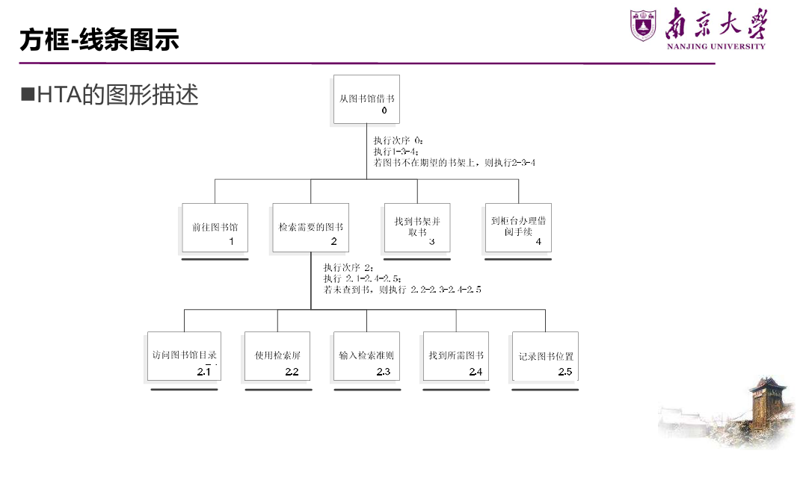

# Final
## lec1&2 人机交互概述
### 什么是人机交互


**人机交互**（Human-Computer Interaction，HCI）是研究人类与计算机系统之间的交互方式和设计原则的学科。它涉及到用户界面设计、用户体验、可用性评估等方面，旨在提高计算机系统的易用性和用户满意度。

### 人机交互的发展历史


### 人机交互与软件工程
前者是对后者的促进和补充，二者结合存在许多困难

## lec10 人机交互的基础知识

### 交互形式
- 直接操纵，如图形用户界面（GUI）；
- 隐喻，如桌面隐喻（Desktop Metaphor）；
- 问答，如命令行

### 信息处理模型
#### 人类处理机模型
**人类处理机模型**（Card 等，1983）：最著名的信息处理模型，含三个交互式组件——
  - **感知处理器**：信息输出到声音存储和视觉存储区域；
  - **认知处理器**：输入输出到工作记忆；
  - **动作处理器**：执行动作。

**存在的问题**：把认知描述为一系列处理步骤；仅关注**单个人、单个任务**，忽视复杂操作中人与人、任务与任务的互动以及环境影响 →（发展出）**外部认知模型、分布式认知模型**。

#### 格式塔心理学
研究人如何感知一个**良好组织的模式**，而非视为一系列相互独立的部分——**事物的整体区别于部分的组合**。"Gestalt"是德语"完形/型式"，故又称完形心理学。用户感知时总尽可能将其视为一个"好"的型式。核心原则：

- **相近性原则**：空间上靠近的物体容易被视为整体 → 设计界面时按相关性对组件分组（如列表页将相关信息组合重复排列，同组元素更靠拢使视觉聚焦）；
- **相似性原则**：习惯把看上去相似的物体看成整体 → 功能相近的组件用相同/相近的表现形式（用不同大小、颜色、形状创建对比或视觉权重，弱化或凸显内容）；
- **连续性原则**：共线或具有相同方向的物体会被组合 → 将组件对齐增强主观感知；
- **对称性原则**：相互对称且能组合为有意义单元的物体会被组合；
- **完整和闭合性原则**：人们倾向忽视轮廓间隙、将其视为完整整体 → 页面空白可帮助分组；
- **前景 & 背景**：某些情况下可互换（"整体区别于局部"）。

格式塔对界面理解影响深刻——屏幕格式塔（Law of lines）、文字格式塔、标题格式塔（如何理解粗体字）、段落格式塔等。

格式塔反例——**对比（Contrast）**让重点更突出。

#### 记忆特性
三个阶段（Atkinson 和 Shiffrin），彼此可交换信息：**感觉记忆 → 短时记忆 → 长时记忆**。

- **感觉记忆**（瞬时记忆）：在脑中持续约 **1 秒**，把相继出现的图片组合成连续序列，产生动态影像；
- **短时记忆**（工作记忆）：感觉记忆经编码形成，约保持 **30 秒**，储存当前正在使用的信息，是信息加工系统的核心（可理解为计算机内存），存储能力约 **7±2 个信息单元**；
  - **组块（chunking）**：通过将信息组合成有意义的单位帮助记住复杂信息（如 86-25-8362 1360-907）；
- **长时记忆**：短时记忆经进一步加工后变为长时记忆，**只有与长时记忆已有信息有某种联系的新信息才能进入**，容量几乎无限。
  - 启发：用**线索**引导用户完成任务；追求创新设计时也应结合优秀的交互范型。

**7±2 理论 vs. 交互式系统设计**：

- 表面影响：菜单最多 7 个选项、工具栏只显示 7 个图标；
- 事实：浏览菜单和工具栏基于人的**识别**功能，而**人识别事物的能力远胜于回忆**。设计时尽量减小记忆需求，可通过把信息放入一定上下文来减少信息单元数目。

**遗忘**：长时记忆中的信息有时无法提取，但不代表信息丢失。

**易出错**："人为错误"指人未发挥自身功能而产生的失误，可能降低交互系统功能——表面看是误解/误操作/大意，但**大部分交互问题源于系统设计本身**。

### 交互设备
- **基于命令的界面**：键入特定命令或组合键执行任务。优点：专家用户快速精确、较 GUI 节约系统资源、可动态配置选项；设计问题：命令的形式/语法/组织、标记命名命令的方法应尽量一致；
- **WIMP 和 GUI**：WIMP = Window, Icon, Menu, Pointing；GUI = Graphical User Interface。设计问题：窗口管理与切换、菜单选项的最佳术语、消除图标歧义；
- **多媒体界面**：在单个界面组合图形、文本、视频、声音、动画并连接各种交互。优点：呈现信息更好、增强快速访问能力、更易学更有乐趣；设计问题：何时用音频 vs 图形、声音 vs 动画；
- **虚拟现实和增强现实（VR & AR）**：身临其境，3D 空间中交互导航。设计问题：防止体验不好、最有效的导航方式（第一/第三人称）、虚拟环境中协作沟通；
- **信息可视化和仪表盘**：信息可视化是交互且动态的图形，目标提高发现/决策/解释能力；仪表盘往往不可交互、描述系统当前状态。设计问题：易理解易推理、是否用动画/交互、2D 还是 3D、何种隐喻；
- **笔式交互和触摸交互**；
- **手势界面**：借助相机、传感器和计算机视觉识别身体/手臂/手势，适用于双手不便时（家电控制、手术室）。设计问题：如何识别和描绘手势、确定手势的开始与结束；
- **实物界面（Tangible Interface）**：基于传感器，物理对象与数字表示结合，操纵物理对象引起数字效应。优点：创造性操纵、动态信息多方式呈现、支持多人探索；设计问题：物理活动与效果如何组合、用何种实物使操作自然；
- **可穿戴计算**：设计问题——舒适、卫生、续航、交互方式选择；
- **脑机界面**。

## lec3 交互设计目标与原则
### 交互框架：EEC 模型
**执行/评估活动周期**（Execution-Evaluation Cycle，EEC）是理解人机交互最有影响力的框架之一。
它把"用户与系统交互"这件事拆解成可分析的结构
四个核心要素：**目标（Goal）**、**执行（Execution）**、**客观因素 / 外部世界（World）**、**评估（Evaluation）**。
#### 目标（Goal）≠ 意图（Intention）

- **单个目标可以对应多个意图。**
  - 例：目标是"删除文档中的部分内容"。
    - 意图 1：通过编辑菜单删除；
    - 意图 2：通过删除按钮删除。
- **每个意图又可以包含一系列具体活动（动作）。**

#### EEC 的七个阶段

EEC 从**用户视角**探讨人机界面问题，一个完整循环代表一个动作，共七个阶段：

- **阶段 1–4：执行阶段**（确立目标 → 形成意图 → 明确动作序列 → 执行动作）；
- **阶段 5–7：评估阶段**（感知系统状态 → 解释系统状态 → 对照目标进行评估）。

> 经典例子：夜晚看书——产生"光线不够想看书"的目标，形成"开灯"的意图，执行按开关的动作，再观察、解释、评估房间是否变亮。
#### 执行隔阂 & 评估隔阂

EEC 模型可以解释**为什么有些界面用起来有问题**：

- **执行隔阂（Gulf of Execution）**：用户为达成目标所设想的动作，与系统实际允许的动作之间的差别。
- **评估隔阂（Gulf of Evaluation）**：系统状态的实际表现，与用户预期之间的差别。

好的设计就是要尽量**缩小这两个隔阂**。

### 可用性目标
可用性目标的目的，是为交互设计人员提供一套**评估交互式产品**各方面的具体方法。常见的可用性属性包括：易学性、易记性、效用性、高效率等。

#### 1. 易学性（Learnability）

- 指使用系统的难易程度，对应**学习曲线的开头部分**。
- 关键问题：用户**愿意花多少时间**学习一个产品？让用户学会执行某任务要花多长时间？
- 经验法则：**"10 分钟法则"**，理想情况下用户应能在很短时间内上手。

#### 2. 易记性（Memorability）

- 指学会使用后，**记住该产品如何使用**的难易程度，隔一段时间再用时能迅速回想，而不必重新学习。
- 影响因素（提升易记性的手段）：
  - **意义**：有意义的图标、命令名、菜单项；
  - **位置**：将特定对象放在固定的特殊位置；
  - **分组**：按逻辑对事物进行恰当分组；
  - **惯例**：尽可能使用通用的对象或符号；
  - **冗余**：用多个感知通道对同一信息进行编码。
- 启发：**良好的组织 + 借助用户已有经验**，能显著提高易记性。

#### 3. 效用性（Utility）

- 指产品在多大程度上提供了**正确的功能**，让用户能做他们需要做或想做的事。
- 高效用例：提供强大计算工具的会计软件包；
- 低效用例：只能画多边形、不允许徒手绘制的绘图工具。

#### 4. 高效率（Efficiency）

- 指用户**学会之后**，产品对其执行任务的支持程度，熟练用户应达到更高的生产力水平。
- 即用户到达学习曲线**平坦阶段**时的稳定绩效水平。需要考虑：**如何度量？**

#### 5. 安全性（Safety）

避免用户陷入危险或不好的情形，分两个层面：

- **工效学层面**：如在特殊/危险环境中允许远程操控计算机；
- **操作层面**：帮助用户在任何情况下避免因**偶然执行了不必要的操作**而造成的危险，也包括用户对"出错后果"的恐惧及其对行为的影响。
- 建议：
  - 减少按键/按钮**被误触发**的风险；
  - 为用户提供各种**出错后的恢复方法**。

### 用户体验目标
交互式系统通常包含**多样化的用户体验目标**，涵盖一系列情绪和感受（如有趣、愉悦、令人满足、有美感等）。

- 在**特定时间和地点**与产品交互时，选择最能传达用户感受、当前状态、情绪的词汇，可帮助设计者理解用户体验的**多面性与变化性本质**。

#### 体验与可用性的关系：主观 vs. 客观

可用性偏**客观**（能否高效完成任务），体验偏**主观**（用得开不开心），二者存在**矛盾性**：

- 许多玩家偏爱**最具挑战、不简单**的游戏，这恰恰"违反"了可用性；
- 用塑料锤砸"打地鼠"比鼠标点击更费劲、更易出错，但体验**更愉快有趣**；
- 有些可用性目标与体验目标**不兼容**（如一个既"绝对安全"又"刺激有趣"的过程控制系统可能不可取）。

> **认识并理解可用性与其他用户体验目标之间的关系，是交互设计的核心。**

#### 超越可用性 & 暗黑模式

- Schaffer 认为应**更多关注用户体验而非单纯可用性**：很多网站的目的是**说服或影响**用户，而非让用户最高效地完成任务（如网店核心策略是诱导购买"本不需要的东西"，这与可用性目标天然冲突）。
- **暗黑模式（Dark Pattern）**：某些"狡猾"的设计会刻意制造负面体验、误导用户。
- 正向的"以说服为目的的设计"，关键在于用**巧妙且令人愉快**的方式赢得用户信任、让用户舒服，而非欺骗

### 简易可用性工程
一种以**提高产品可用性**为目标的先进产品开发方法论, 强调**以人为中心**进行交互式产品的设计研发。

#### 四种关键技术（简化方法）

1. **用户和任务观察**
   - 了解目标用户是可用性工程的第一步；
   - 要**直接接触潜在用户**，不能满足于间接接触、道听途说；
   - 牢记：**"你"不是用户！**
2. **场景（Scenario）/ 原型**：通过省略系统部分内容来降低实现复杂度
   - **水平原型**：减少功能深度，呈现界面表层（覆盖面广但浅）；
   - **垂直原型**：减少功能数量，但对所选功能做完整实现（窄而深）。

3. **简化的边做边说（Thinking Aloud）**
   - 让真实用户在执行特定任务时**讲出自己的所思所想**；
   - 被认为是**最有价值的单个可用性工程方法**；
   - 能了解用户**为什么这样做**，并发现其对系统的误解；
   - 实验人员需不断提示用户，或请其事先观摩示范。

4. **启发式评估（Heuristic Evaluation）**
   - 研究表明能发现大量可用性问题，剩余的可用边做边说补充发现；
   - 为避免个人偏见，应让**多个不同的人**分别评估；
   - **需要多少名评估专家？** 用公式估算发现的问题数：
     - **发现的问题数 = N × (1 − (1 − L)ⁿ)**
     - N：设计中存在的可用性问题总数；
     - L：单个参与者能发现问题的比例（经验值约 **31%**）；
     - n：评估专家人数。
   - **结论：约 5 名专家可发现约 80% 的可用性问题**，被认为是最恰当的测试人数；建议**分阶段**进行测试。

### 交互设计原则
#### 基本规则（by Alan Dix）

- **可学习性（Learnability）**：新用户能据此开始有效交互并逐步获得最大性能；
- **灵活性（Flexibility）**：用户与系统能以多种方式交换信息；
- **健壮性（Robustness）**：在支持用户达成目标、评估成果方面提供的支持程度。

#### 黄金规则（Eight Golden Rules，by Ben Shneiderman）

1. **尽可能保证一致**——让界面熟悉、可预测，是**最容易被违背**的原则；体现在一致的动作序列、术语、颜色、布局、字体等。
2. **符合普遍可用性**——兼顾用户熟练度、年龄、身体状况等差异：
   - 专家用户：提供缩写/快捷键，丰富界面；
   - 新手用户：提供引导性帮助信息。
3. **提供信息丰富的反馈**——常用操作反馈可简短，不常用操作反馈应丰富；途径是界面对象的可视化表现。
4. **设计对话框以生成"结束信息"**——让用户知道任务何时完成，产生满足感、轻松感，并帮助用户放下临时想法。
5. **预防并处理错误**——
   - 预防：将不适当的菜单项灰显屏蔽、禁止数值域输入字母等；
   - 处理：提供简单、有建设性、具体的指导帮助用户恢复。
6. **让操作容易撤销**——减轻焦虑、鼓励尝试；可针对单个操作、数据输入或一组完整操作。
7. **支持内部控制点**——让用户成为**主动者**而非被动响应者：避免模态对话框、避免冗长引导序列、提供"取消/重做/放弃"等出口。
8. **减轻短时记忆负担**——人的短时记忆容量有限，故界面尽量简单、风格统一、减少窗口间移动、提供在线帮助、给足学习时间。

#### 十项启发式规则（Ten Heuristics，by Jakob Nielsen）

1. **系统状态的可见度**——对耗时较长（>3–5 秒）的操作给出**显式反馈**：变色、刷新、进度条等。
2. **系统与现实世界的吻合**——使用用户熟悉的词汇、短语和概念（而非内部术语），遵循现实惯例，让信息以自然逻辑顺序出现。
3. **用户享有控制权和自主权**——为误操作提供"返回方法"（undo / redo / 返回主页等）。
4. **一致性和标准化**——同一功能用一致的术语和形式，图标无歧义，颜色/布局/字体一致。
5. **避免出错**——从设计上消除用户犯错的可能（Avoid possibility for user to make errors）。
6. **依赖识别而非记忆**——把选项、动作可见化，让用户"认出"而不必"记住"。
7. **使用的灵活性和高效性**——新手用更易（虽长）的交互，高级/高频用户提供快捷键、特殊键、宏等；兼顾老年人、专家等不同偏好。
8. **帮助用户识别、诊断和恢复错误**——错误信息用**自然语言**（不用代码）、精确指出问题、并建设性地给出解决方案。
9. **帮助和文档**——必须提供帮助/手册/用户指南，语言与格式应简单、术语标准（如 MS Help：标准化格式、提供搜索、书本隐喻、善用链接）。
10. **审美感和最小化设计**——对话框不堆砌无关信息（**小而精** > 大而全），使用标准通用控件（滑块、按钮等），选用适合屏幕显示、可读性强的字体字号。

## 交互式系统的需求
### 产品特性

- **功能不同**：智能冰箱应能提示牛奶用完；字处理器应支持多种格式；
- **物理条件不同**：移动设备系统应尽量小、屏幕显示受限；
- **使用环境不同**：
  - 物理环境（采光、噪音、尘土）；
  - 社会环境（是否共享数据、同步还是异步）；
  - 组织环境（用户支持质量、响应速度、是否提供培训）；
  - 技术环境（运行平台、兼容何种技术）。

### 用户差异
#### 体验水平差异

- 误区：程序员只为专家设计界面，市场人员只要求适合新手；
- 真相：**数目最多、最稳定、最重要的是中间用户**，却常被忽略；
- 设计目标：让新手**快速无痛苦**地成为中间用户、不为想成专家者设障碍、让中间用户**感到愉快**（其技能将稳定在中间层）。

**新手用户**：敏感、易有挫折感。设计要求：不把新手状态当目标、学习过程快速有针对性、充分反映用户对任务的心智模型、帮助不应固定在界面中（向导对话框较好，别用在线帮助作学习指导）、菜单项应有解释性。

**专家用户**：对缺经验用户有异乎寻常的影响（"专家说不好就不好"）、欣赏更新更强功能、不受复杂性增加干扰。设计要求：对常用工具集要能**快速访问**。

**中间用户**：需要工具、知道如何用参考资料、能区分常用与少用功能、高级功能的存在让其放心。设计要求：**工具提示（Tooltip）是最好的习惯用法**、在线帮助是极佳工具、把常用工具放界面**前端中心**、提供额外高级特性。

#### 年龄差异

- **老年人**：65 岁以上多数有某种残疾，技术应支持残缺部位（听觉、言语、灵活性），设计须**清楚、简单、容许出错**、用冗余支持信息访问；
- **儿童**：设计时让他们**参加**很重要，允许多种输入模式（触觉/手写），用文本+图形+声音的**冗余显示**增强体验。

#### 文化差异

- 符号意义因文化而异（√ 和 X 表肯定/否定不通用）、姿势理解有别（点头 vs 摇头）、颜色使用不同（红绿在各国含义不同）→ 通过**冗余**阐明特定颜色的指定意义。

#### 健康差异

每个国家至少 10% 人口有残疾。

- **视觉损伤**：GUI 增加降低了视障用户应用可能性 → 辅以声音和触觉应用（Hearme、Seeing AI）；
- **听觉损伤**：对图形界面交互影响比视觉残疾小，但多媒体和声音增加带来困难 → 给听觉内容加**文字描述**、姿势识别作输出方式；
- **身体损伤**：用语音输入输出（针对无言语障碍者）、用姿势和眼球跟踪控制；
- **语音损伤**：提供合成语音和基于文本的通信（语音合成须快速反映自然会话步调）；
- **诵读困难**：提供拼写更正、一致的导航结构和清晰标识。

### 用户建模-人物角色(Persona)
如何用用户研究数据设计出满意产品？用**人物角色**。

- 不是真实的人，而是**基于真实人的行为和动机**、在整个设计过程中代表真实人的**综合原型**；
- 建立在人口统计学调查所得的**实际用户行为数据**基础上；
- 概念简单但使用复杂，**拼凑几个用户档案是不行的**。

#### 人物角色解决的三个设计问题

- **弹性用户**：为"弹性用户"设计等于允许开发者随意编码却仍号称服务"用户"（如设计医院产品时想"满足所有护士"）；
- **自参考设计**：设计者把自己的目标、动机、技巧、心智模型投射进产品；
- **边缘情况设计**：边缘情况必须考虑但不应成为关注焦点（问："A 会经常这样操作吗？"）。

#### 人物角色的构造

两种错误观点：A "专业开发人员最懂什么对用户合适"、B "用户最了解需要、应让他们指导设计"。

人物角色 = 与系统有关的用户假定的一组**公共需要、兴趣、期望、行为模式和责任**（属性可能为若干用户共有，同一用户也可扮演任意个不同角色，如频繁使用文字处理软件的用户有写作者/编辑者/排版者角色）。

构造基于如下问题：谁将使用系统？属于哪类人群？什么因素决定他们怎样使用？与软件关系有何特征？通常需要什么支持？对软件有怎样的行为和期望？

> 例：设计笔记本上的演示程序包，人物角色"日常最低要求演示者"（公司销售代表）——经常使用、快速方便、简单操作、简洁标准格式（项目符号列表、条形/饼图、标准图形库）。

注意：关注**与界面设计有关**的角色特征、关注使角色**相互区别**的特征、留心**焦点角色**（最常见最典型）。

#### 建模过程

**拼凑**（头脑风暴产生零碎片段，先不顾细节）→ **组织**（分组分类、归并删除冗余）→ **细节**（建立完善描述、补充遗漏数据）→ **求精**（推敲改进），循环反复。

### 需求获取、分析和验证
#### 观察

设计最初可能不知问什么、由谁回答；没有实际讨论和观察就不可能得到完整工作流程画面。

- **直接观察**：陪同工作直接获取信息，可能影响日常活动，可提问"这是你通常完成任务的方式吗？"；
- **间接观察**：用视频/录音获取，观察者更舒适。

#### 场景（Scenario）

表示任务和工作结构的**非正式的叙述性描述**，以叙述方式描述人的行为/任务，发掘上下文、用户需要与需求。

- "讲故事"是人们解释自己做什么的最自然方式，焦点是**用户希望达到的目标**；
- 若场景反复提到某形式/行为/地点，表明它是该活动的核心；
- 通常来自专题讨论或访谈。


#### HTA

层次化任务分析（HTA）

应用最广的任务分析技术——把任务分解为子任务，再分解为更细子任务，组织成**执行次序**说明实际如何执行。

> 例：图书馆"借书"——子任务有访问目录、按姓名/书名/主题检索、记录位置、找书架取书、到柜台办手续。
>
> 执行次序写法：
> ```
> 0. 借书
>   1. 前往图书馆
>   2. 检索需要的图书
>     2.1 访问图书馆目录
>     2.2 使用检索屏
>     2.3 输入检索准则
>     2.4 找出需要的图书
>     2.5 记录图书位置
>   3. 找到书架并取书
>   4. 到柜台办理借阅手续
> 执行次序0：执行1-3-4；若书不在期望书架，则执行2-3-4
> 执行次序2：执行2.1-2.4-2.5；若未查到，则执行2.2-2.3-2.4-2.5
> ```

**终止规则**（任务分析是迭代过程，何时停止分解）：

- 任务包含复杂机械响应处（如鼠标移动），分解无价值 → 终止；
- 涉及内部决断处：若决断与外部动作（查文档）相关则分解，若**纯认知性**则终止。

**图形描述**：方框-线条图示（HTA 的图形形式）。


用途

- **手册和教学**："如何做"手册适于培训（如拆卸擦枪、安装软件）；
- **需求获取和系统设计**：任务分析本身不是需求获取，但有助于需求的完整表达；
- **详细的接口设计**：应用于菜单设计。

#### 原型（Prototype）

##### 概念模型与心智模型

制作原型前先关注用户的**心智模型**。**概念模型**是对系统如何组织和操作的高级描述，理想情况下用户心智模型应与设计师概念模型相同。

- **基于对象的概念模型**：常基于物理世界类比（书籍、工具、车辆），经典如 **Star Interface**（基于办公用品）。隐喻的优势：使学习新系统更容易、帮助理解底层概念模型、使计算机更易被不同用户访问（Johnson et al. 1989）；但隐喻也会有问题。

##### 原型的重要性

原型是在某方面接近真实产品、便于不断评估改进的模型（如房屋桥梁的缩微模型）。

- 评估和反馈是交互设计的核心；
- 用户往往不能准确描述需要，但**看到或尝试后就知道不需要什么**；
- 涉众更容易看到、持有和与原型交互，团队成员有效沟通，原型回答问题并支持在备选方案中选择。

##### 原型分类

- **低保真原型**（多数项目首选）：与最终产品不太相似，用不同材料（纸张、纸板，如 PalmPilot 的木雕原型）；优点是**简单、快速、便宜、易制作和修改**；
- **高保真原型**：与最终产品接近、用相同材料（如 Visual Basic 开发的原型）；制作时间长、难修改；**风险**——用户会认为原型就是系统，开发人员可能误以为已找到满意设计。

低保真原型的具体形式：

- **草图**：不要纠结绘画水平；每张卡片代表一个屏幕或部分，常用于网站开发；
- **故事板（Storyboard）**：一系列草图展示用户如何用设备完成任务，设计早期使用，常与场景一起用、有更多细节、可角色扮演；
- **绿野仙踪法（Wizard-of-Oz）**：用户以为在与计算系统交互，实际是开发人员在响应。

原型工具：Mockups、DENIM 等。

## 交互式系统的设计
### 设计框架
过早把重点放在小细节、小部件和精细交互上会妨碍产品设计——应先在**高层次**关注用户界面和相关行为的**整体结构**（如房屋设计先定整体）。设计框架要：定义高层次屏幕布局、定义产品的工作流/行为/组织。

#### 1. 定义外形因素和输入方法

- **外形因素**：设计什么样的产品？（高分辨率屏的 Web 应用？轻便低分辨率、明暗都看得见的手机？）产品特点和约束对设计提出什么要求（回想人物角色和场景剧本）；
- **输入方法**：产品与用户互动的形式，取决于外形和人物角色的能力与喜好，哪种方式或组合更适合设定的人物角色。

#### 2. 定义功能和数据元素

- **数据元素**：交互产品中的基本主体（相片、电子邮件、订单）；
- **功能元素**：对数据元素操作的工具，以及输入/放置数据元素的位置；
- 例：智能电话角色 Vivien 的功能元素——快速拨号键、从地址簿/邮件/约会/备忘录选联系人、某些情境下自动拨号键。**用场景剧本检验！**

#### 3. 决定功能组合层次

元素分组以促进任务角色的操作流程。需考虑：哪些元素需大片视频区域、容器如何组织优化工作流、哪些元素一起使用。受平台、屏幕大小、外形、输入方法影响。**有比较关系或一起使用的容器应相邻；表达一个过程多步骤的对象通常放一起并遵循次序。**

#### 4. 勾画大致的设计框架

最初界面视觉化应非常简单——**方块图阶段**：用粗略方块图表达并区分每个视图，方块图对应窗格、控制部件（如工具栏），为每个方块添加标签和注解。注意不要被某个特殊区域的细枝末节分散精力。

#### 5. 构建关键情景场景剧本

描述人物角色如何同产品交互、最频繁使用界面的**主要路径**，重点在任务层（如邮件应用的关键线路是读写邮件，而非配置服务器）。须在细节上严谨描述每个主要交互的精确行为，可用低保真草图序列的故事板走查。

#### 6. 通过验证性场景剧本检查设计

验证性场景不需很多细节，但包含一系列**"如果怎样，将怎样"**的问题（设计过程可循环往复）：

- **关键线路的变种**：替代途径（如 Vivien 不打电话改发邮件）；
- **必须使用的场景**：必须执行但不常发生（如手机二手买卖需删除原用户信息）；
- **边缘情形场景**：非典型、不常用功能（如添加两个同名联系人）。

### 设计中的折衷

#### 个性化和配置

是否应让产品具有用户定制功能？

- **个性化（Personalization）**：人们喜欢改变周围事物使之适合自己——必须简单易用、确定选择前给预览机会、必须容易撤销；
- **配置（Configuration）**：移动、添加或删除持久对象，是富有经验用户所期望的，包含多种形式。

#### 本地化和国际化

- **国际化（i18n）**：设计软件时将其与特定语言/地区**脱钩**的过程，移植时本身不用改内部工程，意味着产品有适用于任何地方的"潜力"，**只需做一次**；
- **本地化（l10n）**：移植时加上与特定区域有关的信息和翻译文件、为更适合"特定"地方而增添特色，**针对不同区域各做一次**。

#### 审美学与实用性

**一个漂亮的界面不一定是好界面！**

- 冲突：为确保文本可读性，背景采用较低对比度；复杂强烈的对比可能获奖但不实用；
- 交互设计角度：**根据语义和任务因素进行视觉组织最重要**，视觉美学重要性稍低——先实现良好的基本布局，再在此基础上改进美学。
- 组件之间的**空白**非常重要，组件的**对齐**影响界面的可理解性和易用性。

### 软件设计中的考虑

让软件**友好和体贴**、用语有趣、做"聪明"的软件（而非"不聪明"的）。

#### 加快系统的响应时间

软件的空闲时间被浪费了（CPU 除等待外什么都没做）。如何利用空闲时间：对用户可能的操作作几个假设（如 Mac OS X 的 Spotlight 比 Windows 搜索快，因为利用空闲时间索引硬盘）。需以全新、更主动的方式思考软件如何帮人实现目标。

#### 减轻用户的记忆负担

使用软件需记两类知识：**软件操作相关**（选哪个命令、文件在哪个目录）和**任务领域知识相关**（哪些函数可用、参数和返回值）。好软件通过回忆用户上次行为预测可能操作、用以前设置作默认值（文档目录、窗口位置等）。

#### 减少用户的等待感

- 用反馈让用户了解进度和状态（进度对话框）；
- 以**渐进方式**呈现结果（分成多个连续部分顺序提供，先全局概括再细节）；
- 给用户分配任务分散注意力；
- 降低用户的期望值。

#### 设计好的出错信息（四个原则）

- 用**清晰的语言**表达，不用难懂的代码；
- 语言**精炼准确**，不空泛模糊；
- 对解决问题提供**建设性帮助**；
- 出错信息应**友好**，不威胁或责备用户。

### 简化设计的策略

> 传统观念：功能越多软件越强大越受青睐；现实：功能越多越难发现真正有价值的功能，遗留代码越沉重、维护成本越高。
> "一本书的完成，不在不能再加入任何内容的时候，而在不能再删去任何内容的时候。"——伏尔泰

四种策略：**删除、组织、隐藏、转移**。

#### 策略一：删除

最明显的简化方法（64% 的软件功能"从未使用或极少使用"——Standish Group 2002）。删除杂乱特性可让设计师专注、让用户心无旁骛，但要避免得到"简单功能叠加的毫无特色产品"，保证只交付真正有价值的功能。

- **关注核心**：客户更关注基本功能的改进、影响日常体验的功能；
- **砍掉残缺功能**：警惕**"沉没成本误区"**，问"为什么要留着它"而非"为什么去掉它"；
- **不要因客户要求就增加功能**：倾听但不盲从（问"目标用户经常遇到这个问题吗"）；
- **删除错误**：如银行对账单时间段选择——**选择比键入更优**（支付宝身份认证例子）；
- **删除视觉混乱**：减少用户必须处理的信息、让**数据墨水率**越来越高——用空白/轻微背景划分而非线条、尽量少强调（仅加粗）、用匀称浅色线而非粗黑线、控制信息层次、减少元素大小和形状的变化；
- **删减文字**：删引见性文字、不必要说明、繁琐解释，使用描述性链接（而非"单击这里""更多内容"）；**精简句子**（69 字 → 31 字）；
- **不要删减过多**：东京苹果店没按钮的电梯——人们希望掌控局面，足够的控制能消除焦虑，但太多控制会因选择浪费时间（对应启发式规则"用户控制权和自主权"）。

#### 策略二：组织

最快捷的简化方式，离不开**分块**（**7±2 法则**）：

- **名词**：可按字母表、时间或空间顺序排列的清单；
- **动词**：围绕行为组织（人们希望按特定步骤做事）；
- **确定清晰的分类标准**：多找用户询问其分类标准（反例：输入"<"放哪里——违反"系统和现实世界吻合"）；
- **利用不可见的网格对齐界面元素**：布局对让用户感觉简单十分重要；
- **大小和位置**：重要元素大、不重要的小（重要性 1/2 → 大小做成 1/4），相似元素放一起；
- **感知分层**：眯眼观察屏幕看能否区分不同层；
- **期望路径**：别被规划图中清晰线条和整洁布局迷惑。

#### 策略三：隐藏

低成本简化方案，用户不会因不常用功能分散注意力，可作删除的开始，但须仔细权衡隐藏哪些。

- **隐藏什么**：主流用户很少用但自身需更新的功能、事关细节的（服务器配置、邮件签名）、选项和偏好、特定于地区的信息；
- **自定义**：很耗时且要求了如指掌，主流用户感兴趣的是展示个性（换桌面照片）而非重设界面——**一般不应让用户自定义软件**，除非工具很简单（如 Facebook 个人简介）；**自动定制**如 MS Office 2000 的"自适应菜单"；
- **渐进展示**：少数核心控制部件供主流用户，扩展精确控制部件供专家（"核心功能加扩展功能"模式），比自定义效果好（自动保存用户选择），要在正确环境给明确提示；
- **适时出现**：过分强调隐藏功能（如给每个词加超链接，《纽约时报》）会导致混乱；成功的隐藏 = 尽可能彻底地隐藏 + 在合适时机位置显示；
- **让功能易于发现**：为隐藏功能打标签（更多、高级），**标签放哪里比做多大更重要**（用户遇到问题时过于关注问题区域，标签再大放在关注点之外也看不到）。

#### 策略四：转移

把功能转移到更合适的地方/平台/对象。

- **在设备内转移**：精简掉的遥控器按钮全部通过电视屏幕菜单管理——遥控器方便、需记的按钮少、用屏幕比加液晶面板便宜（但屏幕菜单的简单易用是挑战）；
- **在设备之间转移**：RunKeeper——手机收集记录跑步数据简单，但小屏难显示全部信息，网站适合输入和查看细节，**利用两个平台优势各司其职**；
- **移动平台与桌面平台**：把某些内容（如输入信息）转移到不同平台可能更好；
- **向用户转移**：把复杂工作留给用户。旅行规划程序——一开始限制太多、不断评判用户规划，**没有上线**；改进后让用户创建并自由命名文件夹（"10 英镑以下""雨天"），每个用户做出适合自己的规划。
- **用户擅长的事情**：让用户感觉简单的前提是搞清楚把什么交给计算机、把什么留给用户。
- **菜刀与钢琴**：简单界面的最高境界是专家和主流用户都觉得好用（菜刀对没下过厨的人和专家都好用，因为可分别设置不同目标，但可能不适合中级用户——解释了为什么有打蛋器）。

### 设计模式
**模式（Pattern）**由英国建筑师 Christopher Alexander 提出——"模式就是某个情形下某个问题的解决方案"，描述了问题和解决方案并说明成功应用于何处。

> 例：问题——人们倾向进入两边透亮的房子，使一边透亮的房子闲置；解决方案——定位每个房间使至少两边外部有户外空间，在两边墙设窗，让自然光从多个方向照入。

HCI 中模式应用还处于起步阶段：

- 模式捕捉的只是**良好设计中不变的特性**，具体实现取决于环境和设计者的创造性；
- **模式不是拿来即用的商品**，每次运用都有所不同。

常见模式：主导航模式、二级导航模式等。

> **轮播（Carousel）模式讨论**：优点——充分使用屏幕空间、当前信息清晰可见；缺点——用户几乎不使用、通常只看见第一幅。**反面模式（Anti-patterns）**：直接从大屏幕网站移植到移动设备的设计。

**开源资源**：组件在许可范围内允许重用和修改，可用于交互设计的设计模式库（Bootstrap、Vue.js）。

**交互设计工具**：Balsamiq、Axure（Axure RP 是专业快速原型工具）。

## 交互设计模型与理论
预测模型概述

**预测模型**能预测用户的执行情况，但**不需对用户做实际测试**，特别适合无法进行用户测试的情形（如比较多套支持方案哪种更有效）。不同模型关注用户执行的不同方面：**GOMS、击键层次模型 KLM、Fitts 定律**。

---

### GOMS 模型

最著名的预测模型，1983 年由 **Card、Moran 和 Newell** 提出，基于**人类处理机模型**，是关于人类如何执行认知—动作型任务、如何与系统交互的理论模型。采用**"分而治之"**思想将任务多层次细化，把每个操作的时间相加即得任务时间（操作指目光移动、识别图标、手移到鼠标等）。

#### GOMS 全称

- **Goal（目标）**：用户要达到什么目的；
- **Operator（操作）**：任务执行的底层行为，不能再分解，为达目标使用的认知过程和物理行为（如点击鼠标）；
- **Method（方法）**：如何完成目标的过程，即对应目标的子目标序列和所需操作（如移动鼠标、输入关键字、点击 Go）；
- **Selection（选择规则）**：当有多种方法时确定选择哪个——GOMS 认为方法选择不是随机的。

> 例：用 GOMS 描述 Word 中删除文本——目标"删除文本"，方法 1"使用菜单删除"：思考需选定文本 → 思考用"剪裁"命令 → 思考"剪裁"在"编辑"菜单 → 选定文本执行剪裁 → 达到目标返回。

#### 方法步骤

选出最高层用户目标 → 写出完成目标的方法（激活子目标）→ 写出子目标的方法（递归，分解到最底层操作停止）。子目标关系有**顺序关系**和**选择关系**（以 `select:` 引导）。

#### 分析

- **优点**：能容易地对不同界面/系统比较分析。例：NYNEX 电话公司用 GOMS 分析发现某新系统效果不理想，放弃使用，节约数百万资金；
- **局限性**：假设用户完全按一种正确方式交互、未描述错误处理过程（只针对不犯错的专家用户）、任务关系描述过于简单、忽略了用户间个体差异。


### 击键层次模型（KLM）

Card 等 1983 年提出，对用户执行情况进行**量化预测**，仅涉及任务性能的一个方面：**时间**。用途——预测无错误情况下专家用户完成任务的时间，便于比较不同系统、确定何种方案最有效支持特定任务。

#### 操作符与执行时间预测

列出操作次序，累加每项操作的预计时间：

`T_execute = T_K + T_P + T_H + T_D + T_M + T_R`

（K 击键、P 指点、H 移手、D 画线、M 思维、R 系统响应）

> 例 1：DOS 下执行 `ipconfig`——`M 9K[ipconfig回车]`，T = 1.35 + 9×0.28 = **3.87s**。
>
> 例 2：菜单选择"修复网络连接"——`H[鼠标] M P[图标] P1[右键] P[修复] P1[左键]`，T = 0.40+1.35+2P+2K = **4.35s**。
>
> 例 3：替换文字编辑器中长度为 5 的单词——`2M + 2H + P + P1 + P + 4K` = 2.70+0.80+1.10+0.20+1.10+0.88 = **6.78s**。

#### 放置 M 操作符的启发式规则

如何确定是否需在某操作前引入一个思维过程：

1. 在每一步需访问长时记忆区的操作前放一个 M；
2. 在所有 K 和 P 之前放 M（K → MK；P → MP）；
3. 删除键入单词/字符串之间的 M（MKMKMK → MKKK）；
4. 删除复合操作之间的 M（如选中 P 和点击 P1：MPMP1 → MPP1）。

#### KLM 分析

建模可给出执行标准任务的时间，但**没有考虑**：错误、学习性、功能性、回忆、专注程度、疲劳、可接受性。

---

### Fitts 定律

用户访问屏幕组件的时间对系统使用效率至关重要。Fitts（1954）能预测使用某种定位设备**指向目标的时间**——根据目标大小及距离计算，可指导按钮的位置、大小和密集程度设计，对 GUI 设计意义明显，是"最健壮并被广泛采用的人类运动模型之一"。

#### 实验与理论来源

- **"轮流轻拍"实验**：要求尽可能准确（而非快速）轮流轻拍两块薄板，记录拍中与失误，得困难指数 `ID = log₂(2A/W)`；
- 对应信息论中的 **Shannon 定理** `C = B log₂(S/N+1)`——Fitts 定律把 S 映射为运动距离/振幅（A）、N 映射为目标宽度（W）。

#### 三个部分

- **困难指数 ID** = log₂(2A/W)（bits）——量化任务困难，与宽度和距离有关；
- **运动时间 MT** = a + b·ID（secs）——在 ID 基础上量化完成时间；
- **性能指数 IP** = ID/MT（bits/sec）——也称吞吐量。

#### MacKenzie 改写

`ID = log₂(A/W + 1)`，`MT = a + b·log₂(A/W + 1)`——更好符合观察数据、精确模拟信息论、困难指数总为整数。常数 a（截距）、b（斜率）由实验数据线性回归得出、与设备相关；一般性计算可用 **a=50, b=150（毫秒）**。A 和 W 测量单位须一致。

> 相同 ID → 相同难度；ID 越小越容易，越大越难。

#### 建议与应用

- **大目标、小距离具有优势**：移动时间随距离增加而增加、随目标减小而增加；
- 屏幕元素应尽可能多占屏幕空间，**最好的像素是光标所处的像素**，应尽量利用**屏幕边缘**的优势；
- 大菜单（如**饼型菜单**）比其他类型更易用。

应用：

- 首先被 Card 等应用于 HCI——鼠标定位时间和错误率优于其他设备、接近最快速率、运动更协调；
- 策略一：**缩短当前位置到目标的距离**（如右键菜单）；
- 策略二：**增大目标大小**（如应用程序菜单区域设计）。

> 实例：Mac OS vs Windows XP（苹果专利）——Mac 菜单沿**屏幕边缘**排列，Windows 菜单在标题栏下面。Jeff Raskin 指出用户往往在距边缘 50 mm 处停下，取 50 mm 作 Mac 菜单宽度：
> - Mac OS：MT = 50 + 150 log₂(80/50+1) ≈ **256** 微秒（等效，边缘使 W 实际无限大更优）；
> - Windows OS：MT = 50 + 150 log₂(80/5+1) ≈ **663** 微秒。
>
> **Mac OS "dock"**：工具栏组件大小可动态改变，为用户提供放大的目标区域、可显示更多图标。（思考其优缺点）


## 评估的基础知识
四种评估范型

### 1. 快速评估（Quick and Dirty）

- 设计人员**非正式地**向用户或顾问了解反馈，以证实设计构思是否符合用户需要；
- 可在**任何阶段**进行，强调"快速了解"而非仔细记录；
- 数据通常是**非正式、叙述性**的（口语、笔记、草图、场景），是设计网站时常用方法；
- 基本特征：**快**。

### 2. 可用性测试（Usability Testing）

- **20 世纪 80 年代的主导方法**；
- 评测**典型用户执行典型任务**的情况，记录出错次数、完成时间等；
- 基本特征：在评估人员的**密切控制**下进行；主要任务是**量化**用户的执行情况；
- 缺点：测试用户数量通常较少，**不适合细致的统计分析**。

### 3. 实地研究（Field Studies）

- 基本特征：在**自然工作环境**中进行；
- 目的：理解用户的实际工作情形以及技术对其的影响；
- 作用：探索新技术应用契机、确定产品需求、促进技术引入、评估技术应用；
- 重难点：**如何不对受试者造成影响**；控制权在用户手中，很难预测将发生的情况。

### 4. 预测性评估（Predictive Evaluation）

- 研究人员通过**想象或建模**界面的使用过程，由**专家**依据对典型用户的了解预测可用性问题；
- 方法：逐步走查（场景/问答式走查法）、用于比较不同界面原型（如用 **Fitts 定律**预测指向目标的时间）；
- 基本特征：**用户可以不在场**，过程快速、成本低。

**人机交互的实证研究方法**

### 研究假设（Hypothesis）

实验通常从**研究假设**开始——一种可通过实证研究**直接检验的精确问题陈述**，它奠定了实验和统计显著性检验的基础。

- **零假设（Null Hypothesis，H0）**：通常指不同实验条件**不会产生差异**；
- **备择假设（Alternative Hypothesis，H1）**：与零假设相反的陈述；
- 实验目标是找到统计学证据**反驳/否定零假设**，以支持备择假设。

> 例：主页用下拉菜单还是弹出菜单？
> H0：两者在定位页面的时间开销上**没有差异**；H1：**存在差异**。（H0 与 H1 必须互斥）
> 可同时研究多对假设，如再针对"用户满意度评价"提出一对 H0/H1。

好假设的标准：用**精确清晰**的语言提出、专注于**单次实验可检验**的一个问题、明确说明对照组或实验条件。

### 自变量与因变量

- **自变量（Independent Variables）**：研究者感兴趣的、可能导致因变量变化的"原因"。
  - "Independent"指该变量**与受试者行为无关**，参与者无法对其施加影响；
  - 至少需要 **2 个取值**，这些取值称为**实验条件（test conditions）**；
  - 人的特性（年龄、性别、身高等）是**天然自变量**，但**不能被"操纵"**。
- **因变量（Dependent Variables）**：研究者感兴趣的**结果或效果**，依赖于受试者行为或自变量变化。
  - 如：任务完成时间、速度、准确性、错误率、重试次数、退格键次数等；
  - **必须被明确定义**，且研究**必须可复现**。
- **区分**：自变量通常是研究者可控制的**实验条件**，因变量通常是需要测量的**实验结果**。
  - 典型自变量：技术/设备类型（打字 vs 语音、鼠标 vs 操纵杆/触摸板）、设计类型（下拉 vs 弹出菜单、字号、对比度、背景色、网站架构）；
  - 典型因变量：效率、准确性、主观满意度、易学性与易记性、体力或认知需求。

### 实验构成

- **实验条件**：需要比较的不同技术、设备或程序；
- **实验单位**：施加实验条件的对象，在 HCI 中通常是具有特定特征（性别、年龄、计算机经验等）的**人类受试者**；
- **分配方式**：将实验单位分配到不同实验条件的方式。

> 例：比较 QWERTY 与 DVORAK 键盘的打字速度。实验条件 = 键盘类型；要求受试者此前都没用过这两种键盘以保证公平；分配用**抛硬币**决定（正面→QWERTY，反面→DVORAK）。

### 分配方式：随机化

- 实验研究的强大之处在于能探索**因果关系**，核心原因是**完全随机化**，将实验条件随机分配给实验单位；
- 传统方法：掷硬币、掷骰子、轮盘、摸球等（现已较少用），更常用**随机数字表**；
- 设计良好的实验中，不仅要随机分配实验条件，还需**随机分配其他因素**。

## 观察用户
### 观察方式

观察能发现一些**意想不到的用户操作方式**（例：文字处理软件中，用户把"模板"当作一类特殊文件来处理）。按场所分两类：

- **真实环境中的观察**：观察者既可作**旁观者**也可作**参与者**，重点是**应用的上下文**；
- **受控环境中的观察**：观察者**不能作为参与者**，重点是**用户执行任务的细节**。

二者差别不大，有时前者会模仿后者的测试条件，实地观察也可作为实验室观察的**补充**。


#### 实验室观察

指在**专门为可用性测试配置的固定设备环境**下进行的观察。某些情况下它是唯一选择（如空间站等危险环境的系统）。

- **实验室布局**：分为**测试区**与**观察区**，为避免干扰二者分开；
- 也可让用户坐在家中测试（如 Windows Live Meeting 等软件），可观察鼠标移动与屏幕变化，使用户处于**更自然真实**的状态。

**优点**：提供**可控且一致**的评估环境，易于分析比较。

**缺点**：环境**人为、不自然**，可能降低结论的普遍性；且**不利于观察多人协作**。

#### 实验室观察的实际问题

- **测试地点选择、设备安装**：摄录面部表情、鼠标与击键过程、更大范围的肢体语言；
- **测试设备检查**：确保设置正确、能正常工作；
- **文档准备**：
  - **协议书**：要求用户签署，说明测试目的、时间，解释其权利，让用户轻松自在；
  - **脚本**：要求用户执行的任务清单。


### 观察框架

观察过程中的事件**复杂且变化迅速**，观察框架用于**组织观察活动、明确观察重点**。

#### Goetz & LeCompte 框架

关注事件的上下文、涉及的人员和技术，从六个角度提问：

- **人员**：在场有哪些人？特征如何？承担什么角色？
- **行为**：人们说了/做了什么？举止、语调、肢体语言如何？有无规律性行为？
- **时间**：行为何时发生？是否与其他行为关联？
- **地点**：行为在何处发生？是否受物理条件影响？
- **原因**：行为为何发生？促成因素是什么？不同人看法是否不同？
- **方式**：行为如何组织？受哪些规则或标准影响？

#### Robson 框架

从八个维度组织观察与数据搜集：**空间**（物理布局）、**行为者**（涉及哪些人）、**活动**（活动及原因）、**物体**（如家具等实物）、**举止**（具体成员举止）、**事件**（是否特定事件的一部分）、**目标**（行为者想达到什么）、**感觉**（用户组及个人情绪）。


### 数据记录

根据研究人员素质、环境与项目特点选取合适方法。

#### 1. 纸笔记录

- 最原始、最廉价；
- 前提：对观察对象有一定了解，从而有**明确的观察侧重点**；
- 优点：事后分析工作量小；
- 缺点：观察者易疲劳、记录速度有限 → **建议将记录者和评估者分开**。

#### 2. 音视频记录

适用于对观察对象不太了解、或观察内容较多时（**特别是边做边说法**）。

- **音频记录**：信息全面无遗漏，但无可见记录、转录烦琐，常作提示细节/情景说明的辅助；
- **视频记录**：能看到参与者在做什么，但难以始终让其停留在视觉范围内，且**信息量大、分析耗时**。

#### 3. 日志和交互记录（间接观察）

适用场合：直接观察可能影响用户，或评估人员无法到现场。根据搜集的数据推断实际情形、发现可用性与体验问题。

- 优点：体现用户**如何完成真实任务**，便于从不同环境的**大量用户**处自动收集数据；适用于用户分散、无法当面测试的情形（如互联网应用和网站设计）。

> 应用举例：
> - 命令行系统中 **6112 条错误命令**分析——**30%** 源于拼写问题 → 需要拼写校对机制；
> - 程序员收到的 **3000 条错误信息**——85% 属 9 个一般性错误；一条糟糕信息"符号未在程序中定义"占 9.8%，因缺少相关信息难以纠正，**改进措辞后降至 1.7%**。

日志可包含的信息：使用频度、每次使用时长、不同操作的使用频度（哪些最常用/很少用）、用户更常用键盘还是鼠标等。

## 询问用户和专家
lec6.md

## 用户测试
lec7.md的一二五

## 以用户为中心
lec12.md的三五